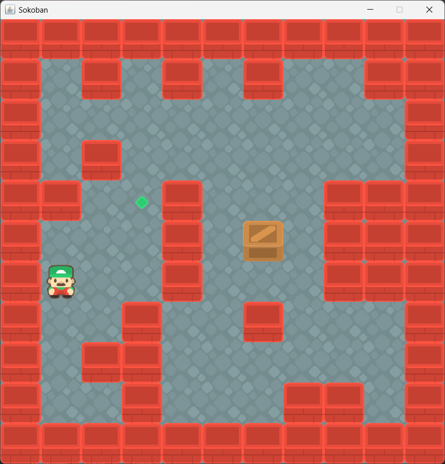

# Sokoban - Procedural Generator (HELMo Project)

Ce dépôt contient mon **tout premier projet** réalisé en BAC 1 (Bachelier en Développement d'Application) à **HELMo**. L'objectif était d'implémenter les mécaniques fondamentales du Sokoban tout en explorant la génération procédurale de niveaux.

---

## 🚀 Concept & Gameplay
Le projet reprend les règles classiques du Sokoban :
* **Objectif :** Un joueur doit déplacer une caisse vers un point cible.
* **Mécaniques :** Le joueur peut pousser la caisse, mais ne peut ni la tirer, ni traverser les murs.
* **Victoire :** La condition est validée dès que la caisse atteint ses coordonnées cibles, déclenchant un changement d'état (ID et sprite).

## 🛠️ Focus Technique : Génération Procédurale "Contrôlée"
L'aspect central de ce projet est son moteur de génération de maps, qui repose sur une approche hybride pour garantir la diversité tout en maintenant la jouabilité :

### 1. Tiling & Patterns
La map est construite à partir d'un set de matrices $5 \times 5$ prédéfinies (`PATTERNS`). Ces blocs subissent des transformations (rotations aléatoires via un `switch` de calcul matriciel) avant d'être injectés dans la grille principale.

### 2. Algorithme de Connectivité (Flood Fill)
Pour garantir que le joueur ne spawn pas dans une zone fermée, une fonction récursive (`recoAlgo`) parcourt la grille après génération.
* Elle compte les cases "sol" accessibles.
* Si le nombre de cases connectées est inférieur au total des sols générés, le niveau est invalidé et régénéré instantanément (processus de *Backtracking* simplifié).

### 3. Placement de la Caisse
La caisse est placée selon un algorithme de "marche aléatoire" à partir de l'objectif. Cela permet de s'assurer, par construction, qu'un chemin de résolution existe théoriquement.

## 📊 Aperçu du projet

  
   
  <em>Interface du jeu utilisant une grille de sprites 64x64 pixels.</em>

## ⚠️ Limitations & Post-mortem
En tant que projet d'initiation, certaines problématiques de gestion d'entités subsistent et constituent d'excellents cas d'étude sur la dette technique initiale :
* **Conflits de spawn :** Risque de superposition rare entre le joueur et l'objectif lors de l'initialisation.
* **Gestion des états :** La logique de déplacement est directement couplée à la matrice d'entiers (`int[][] grille`), illustrant une première approche de la programmation impérative avant la transition vers l'orienté objet pur.

---
*Projet réalisé dans le cadre du cursus de Bachelier en Informatique - HELMo.*

